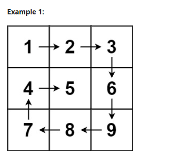
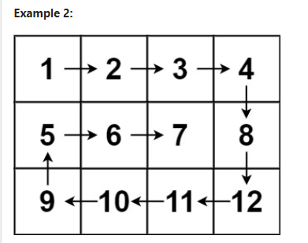

# Problem 1
[Spiral Matrix](https://leetcode.com/problems/spiral-matrix/description/)

Given an m x n matrix, return all elements of the matrix in spiral order.

 

```
Input: matrix = [[1,2,3],[4,5,6],[7,8,9]]
Output: [1,2,3,6,9,8,7,4,5]
```


```
Input: matrix = [[1,2,3,4],[5,6,7,8],[9,10,11,12]]
Output: [1,2,3,4,8,12,11,10,9,5,6,7]
```

*Constraints:*
```
m == matrix.length
n == matrix[i].length
1 <= m, n <= 10
-100 <= matrix[i][j] <= 100
```

## Approach
### Pseudo
```
FUNCTION spiralOrder(matrix)
    INITIALIZE res as empty list
    IF matrix is empty OR matrix[0] is empty THEN
        RETURN res
    
    INITIALIZE h1 = 0
    INITIALIZE h2 = number of rows in matrix - 1
    INITIALIZE c1 = 0
    INITIALIZE c2 = number of columns in matrix - 1
    
    WHILE h1 <= h2 AND c1 <= c2
        // Traverse the top row from left to right
        FOR j FROM c1 TO c2
            ADD matrix[h1][j] TO res
        INCREMENT h1
        
        // Traverse the right column from top to bottom
        FOR i FROM h1 TO h2
            ADD matrix[i][c2] TO res
        DECREMENT c2
        
        // Traverse the bottom row from right to left, if it exists
        IF h1 <= h2 THEN
            FOR j FROM c2 TO c1
                ADD matrix[h2][j] TO res
            DECREMENT h2
        
        // Traverse the left column from bottom to top, if it exists
        IF c1 <= c2 THEN
            FOR i FROM h2 TO h1
                ADD matrix[i][c1] TO res
            INCREMENT c1
    
    RETURN res

```
### Code
```cpp
class Solution {
public:
    vector<int> spiralOrder(vector<vector<int>>& matrix) {
        vector<int> res;
        int h1 = 0, h2 = matrix.size() - 1, c1 = 0, c2 = matrix[0].size() - 1;
        if(matrix.empty() || matrix[0].empty()) return res;
        while (h1 <= h2 && c1 <= c2) {
            // hàng trên cùng
            for (int j = c1; j <= c2; j++) {
                res.push_back(matrix[h1][j]);
            }
            h1++;
            // hàng ngoài cùng bên phải
            for (int i = h1; i <= h2; i++) {
                res.push_back(matrix[i][c2]);
            }
            c2--;
            // hàng dưới cùng
            if (h1 <= h2) {
                for (int j = c2; j >= c1; j--) {
                    res.push_back(matrix[h2][j]);
                }
                h2--;
            }

            // hàng đầu bên trái
            if (c1 <= c2) {
                for (int i = h2; i >= h1; i--) {
                    res.push_back(matrix[i][c1]);
                }
                c1++;
            }
        }
        return res;
    }
};
```

# Problem 2
[3 Sum](https://leetcode.com/problems/3sum/description/)

Given an integer array nums, return all the triplets [nums[i], nums[j], nums[k]] 
such that i != j, i != k, and j != k, and nums[i] + nums[j] + nums[k] == 0.

Notice that the solution set must not contain duplicate triplets.

Example 1:
```
Input: nums = [-1,0,1,2,-1,-4]
Output: [[-1,-1,2],[-1,0,1]]
Explanation: 
nums[0] + nums[1] + nums[2] = (-1) + 0 + 1 = 0.
nums[1] + nums[2] + nums[4] = 0 + 1 + (-1) = 0.
nums[0] + nums[3] + nums[4] = (-1) + 2 + (-1) = 0.
The distinct triplets are [-1,0,1] and [-1,-1,2].
Notice that the order of the output and the order of the triplets does not matter.
```

Example 2:
```
Input: nums = [0,1,1]
Output: []
Explanation: The only possible triplet does not sum up to 0.
```
Example 3:
```
Input: nums = [0,0,0]
Output: [[0,0,0]]
Explanation: The only possible triplet sums up to 0.
```

Constraints:
```
3 <= nums.length <= 3000
-105 <= nums[i] <= 105
```
## Approach
### Pseudo
```
FUNCTION threeSum(nums)
    INITIALIZE output as empty list
    SORT nums in non-decreasing order
    
    FOR i FROM 0 TO length of nums - 1
        IF i > 0 AND nums[i] == nums[i - 1] THEN
            CONTINUE // Skip duplicate elements for the first element of the triplet

        INITIALIZE j as i + 1
        INITIALIZE k as length of nums - 1

        WHILE j < k
            INITIALIZE sum as nums[i] + nums[j] + nums[k]
            
            IF sum == 0 THEN
                ADD [nums[i], nums[j], nums[k]] to output

                // Skip duplicates for the second and third elements
                WHILE j < k AND nums[j] == nums[j + 1]
                    INCREMENT j
                WHILE j < k AND nums[k] == nums[k - 1]
                    DECREMENT k

                INCREMENT j
                DECREMENT k
            ELSE IF sum < 0 THEN
                INCREMENT j
            ELSE
                DECREMENT k
    
    RETURN output

```
### Code
```cpp
class Solution {
public:
    vector<vector<int>> threeSum(vector<int>& nums) {
        int target = 0;
        sort(nums.begin(), nums.end());
        set<vector<int>> s;
        vector<vector<int>> output;
        for (int i = 0; i < nums.size(); i++){
            int j = i + 1;
            int k = nums.size() - 1;
            while (j < k) {
                int sum = nums[i] + nums[j] + nums[k];
                if (sum == target) {
                    s.insert({nums[i], nums[j], nums[k]});
                    j++;
                    k--;
                } else if (sum < target) {
                    j++;
                } else {
                    k--;
                }
            }
        }
        for(auto triplets : s)
            output.push_back(triplets);
        return output;
    }
};
```
