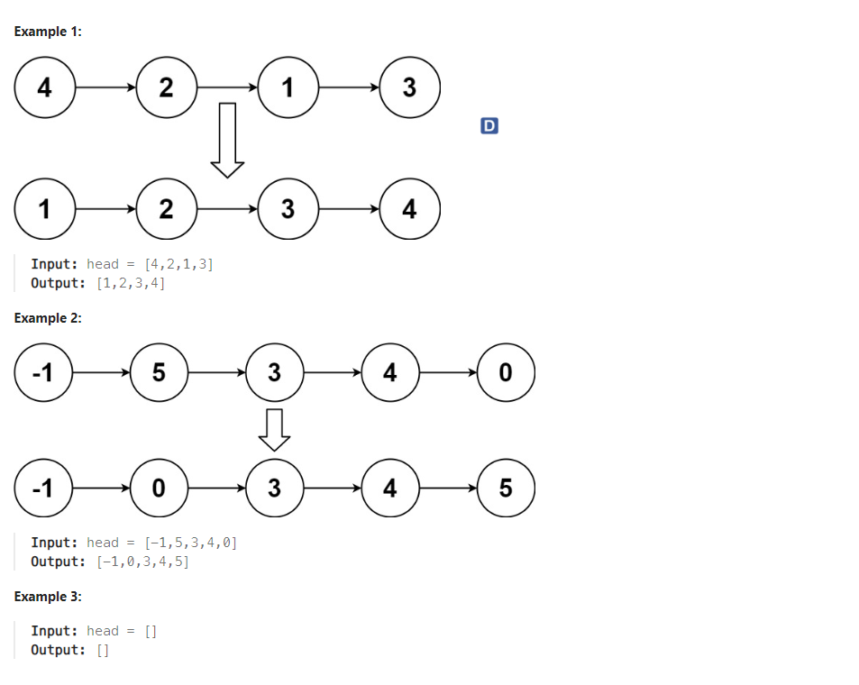
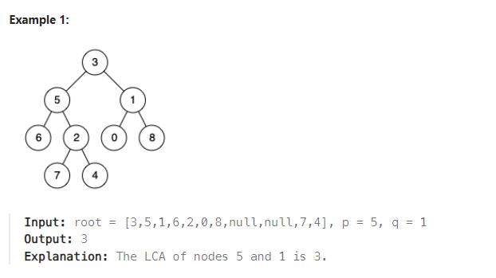
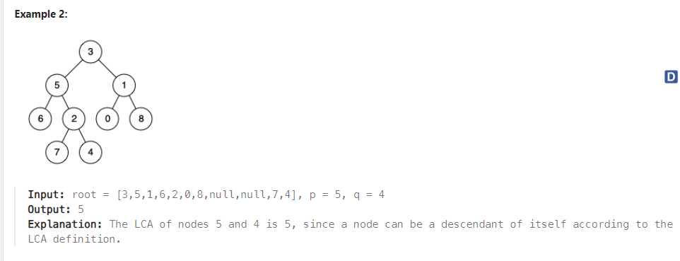
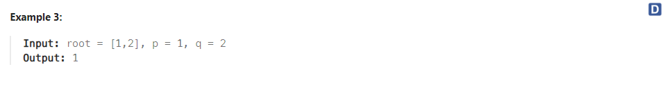

# Problem 1
[Sort List](https://leetcode.com/problems/sort-list/description/)



Constraints:
```
The number of nodes in the list is in the range [0, 5 * 104].
-105 <= Node.val <= 105
```

## Approach 1
### Pseudo
```
Function sortList(head)
    // Step 1: Handle edge case where list is empty
    If head is NULL
        return NULL

    // Step 2: Initialize a temporary pointer and a vector
    temp = head
    vector v

    // Step 3: Extract values from the linked list into the vector
    While temp is not NULL
        Append temp->val to vector v
        temp = temp->next

    // Step 4: Sort the vector
    sort(vector v)

    // Step 5: Create a new head for the sorted list
    newHead = new ListNode(0)
    temp = newHead

    // Step 6: Reconstruct the sorted linked list from the sorted vector
    For each num in vector v
        temp->next = new ListNode(num)
        temp = temp->next

    // Step 7: Set result to the next node of newHead (skipping the dummy head)
    result = newHead->next

    // Step 8: Delete the dummy head node to free memory
    delete newHead

    // Step 9: Return the head of the sorted linked list
    return result
End Function
```
### Code
```cpp
/**
 * Definition for singly-linked list.
 * struct ListNode {
 *     int val;
 *     ListNode *next;
 *     ListNode() : val(0), next(nullptr) {}
 *     ListNode(int x) : val(x), next(nullptr) {}
 *     ListNode(int x, ListNode *next) : val(x), next(next) {}
 * };
 */
class Solution {
public:
    ListNode* sortList(ListNode* head) {
        //TLE
        // for (ListNode* i = head; i != NULL; i = i->next) {
//             ListNode* min = i;
//             for (ListNode* j = i->next; j != NULL; j = j->next) {
//                 if (min->val > j->val) {
//                     min = j;
//                 }
//             }
//             swap(i->val, min->val);
//         }
//         return head;
//     }
       ListNode* temp = head;

        vector<int> v;

        while(temp != NULL)
        {
            v.push_back(temp-> val);
            temp = temp-> next;
        }

        sort(v.begin(),v.end());

        ListNode* newHead = new ListNode(0);
        temp = newHead;

        for(int num : v)
        {
            temp-> next = new ListNode(num);
            temp = temp-> next;
        }
        ListNode* result = newHead-> next;
        delete newHead;

        return result;
    } 
};
```

## Approach 2 [TLE | not accepted but it is the second approach can be used to solve this problem (28/30 test cases)]
### Pseudo
```
function sortList(head):
    i = head
    while i is not NULL:
        minNode = i
        j = i->next
        while j is not NULL:
            if minNode->value > j->value:
                minNode = j
            j = j->next
        if minNode != i:
            swap(i->value, minNode->value)
        i = i->next
    return head

```
### Code
```cpp
/**
 * Definition for singly-linked list.
 * struct ListNode {
 *     int val;
 *     ListNode *next;
 *     ListNode() : val(0), next(nullptr) {}
 *     ListNode(int x) : val(x), next(nullptr) {}
 *     ListNode(int x, ListNode *next) : val(x), next(next) {}
 * };
 */
class Solution {
public:
    ListNode* sortList(ListNode* head) {
        for (ListNode* i = head; i != NULL; i = i->next) {
            ListNode* minNode = i;
            for (ListNode* j = i->next; j != NULL; j = j->next) {
                if (minNode->val > j->val) {
                    minNode = j;
                }
            }
            int tmp = minNode->val;
            minNode->val = i->val;
            i->val = tmp;
        }
        return head;
    }
};
```

# Problem 2
Given a binary tree, find the lowest common ancestor (LCA) of two given nodes in the tree.

According to the definition of LCA on Wikipedia: “The lowest common ancestor is defined between two nodes p and q as the lowest node 
in T that has both p and q as descendants (where we allow a node to be a descendant of itself).”







Constraints:
```
The number of nodes in the tree is in the range [2, 105].
-109 <= Node.val <= 109
All Node.val are unique.
p != q
p and q will exist in the tree.
```

## Approach 1
### Pseudo
```
function getPath(root, path, node):
    if root is NULL:
        return false

    add root to path

    if root is node:
        return true

    if root has a left child and getPath(root->left, path, node):
        return true

    if root has a right child and getPath(root->right, path, node):
        return true

    remove last element from path
    return false

function lowestCommonAncestor(root, p, q):
    pathP = empty list
    pathQ = empty list

    getPath(root, pathP, p)
    getPath(root, pathQ, q)

    index = 0
    while index is less than the size of pathP and the size of pathQ:
        if pathP[index] is not equal to pathQ[index]:
            break
        increment index

    return pathP[index - 1]

```
### Code
```cpp
/**
 * Definition for a binary tree node.
 * struct TreeNode {
 *     int val;
 *     TreeNode *left;
 *     TreeNode *right;
 *     TreeNode(int x) : val(x), left(NULL), right(NULL) {}
 * };
 */
class Solution {
public:
    bool getPath (TreeNode* root, vector <TreeNode*>& path, TreeNode* node) {
        if (root == NULL) return false;
        
        path.push_back (root);
        if (root == node) return true;

        if (root -> left && getPath (root -> left, path, node) ||
            root -> right && getPath (root -> right, path, node))
            return true;
        
        path.pop_back ();
        return false;
    }
    TreeNode* lowestCommonAncestor(TreeNode* root, TreeNode* p, TreeNode* q) {
        vector <TreeNode*> pathP;
        vector <TreeNode*> pathQ;
        getPath (root, pathP, p);
        getPath (root, pathQ, q);

        int i;
        for (i = 0; i < pathP.size () && i < pathQ.size (); ++i) {
            if (pathP[i] != pathQ[i]) break;
        }
        return pathP[i-1];
    }
};
```
## Approach 2
### Pseudo
```
function getAncestor(root, ancestor):
    if root is NULL:
        return
    
    create an empty queue 'bucket'
    add root to 'bucket'
    set ancestor[root] to NULL
    
    while bucket is not empty:
        size = size of bucket
        for i = 0 to size - 1:
            node = front element of bucket
            remove front element from bucket
            
            if node has a left child:
                set ancestor[node.left] to node
                add node.left to bucket
            
            if node has a right child:
                set ancestor[node.right] to node
                add node.right to bucket


function lowestCommonAncestor(root, p, q):
    create an empty map 'ancestor'
    getAncestor(root, ancestor)
    
    create an empty set 'ancestorP'
    
    while p is not NULL:
        add p to 'ancestorP'
        p = ancestor[p]
    
    while q is not NULL:
        if q is in 'ancestorP':
            return q
        q = ancestor[q]
    
    return NULL

```
### Code
```cpp
/**
 * Definition for a binary tree node.
 * struct TreeNode {
 *     int val;
 *     TreeNode *left;
 *     TreeNode *right;
 *     TreeNode(int x) : val(x), left(NULL), right(NULL) {}
 * };
 */
class Solution {
public:
    void getAncestor (TreeNode* root, std::map <TreeNode*, TreeNode*>& ancestor) {
        if (root == NULL) return;
        std::queue <TreeNode*> bucket;
        bucket.push (root);
        ancestor[root] = NULL;
        while (!bucket.empty ()) {
            int size = bucket.size ();
            for (int i = 0; i < size; ++i) {
                TreeNode* node = bucket.front ();
                bucket.pop ();
                if (node -> left){ ancestor[node -> left] = node; bucket.push (node -> left);}
                if (node -> right){ ancestor[node -> right] = node; bucket.push (node -> right);}
            }
        }
    }
    TreeNode* lowestCommonAncestor(TreeNode* root, TreeNode* p, TreeNode* q) {
        std::map <TreeNode*, TreeNode*> ancestor;
        getAncestor (root, ancestor);
        set <TreeNode*> ancestorP;
        while (p) {
            ancestorP.insert (p);
            p = ancestor[p];
        }
        while (q) {
            if (ancestorP.find (q) != ancestorP.end()) return q;
            q = ancestor[q];
        }
        return NULL;
    }
};
```