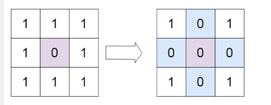
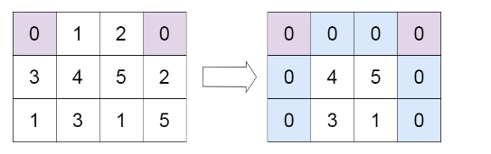

# Proble
([Set Matrix Zeroes](https://leetcode.com/problems/set-matrix-zeroes/description/))

Given an m x n integer matrix matrix, if an element is 0, set its entire row and column to 0's.

You must do it in place.

 

Example 1:



Input: matrix = [[1,1,1],[1,0,1],[1,1,1]]
Output: [[1,0,1],[0,0,0],[1,0,1]]
Example 2:




Input: matrix = [[0,1,2,0],[3,4,5,2],[1,3,1,5]]
Output: [[0,0,0,0],[0,4,5,0],[0,3,1,0]]
 

Constraints:

m == matrix.length
n == matrix[0].length
1 <= m, n <= 200
-231 <= matrix[i][j] <= 231 - 1
## Approach 1
### Pseudo
```
ý tưởng: dùng hai mảng đánh dấu những tọa độ có chung x hoặc y với phần tử 0, duyệt for duyệt tất cả những phần
tử ấy và đặt về 0

Procedure setZeroes(matrix):
Initialize m as the number of rows in the matrix
Initialize n as the number of columns in the matrix
Initialize two empty lists, coordX and coordY

For each row i from 0 to m:
    For each column j from 0 to n:
        If the element at matrix[i][j] is 0:
            Add i to coordX
            Add j to coordY

For each row i from 0 to m:
    If i is in coordX:
        For each column j from 0 to n:
            Set matrix[i][j] to 0

For each column j from 0 to n:
    If j is in coordY:
        For each row i from 0 to m:
            Set matrix[i][j] to 0


```

### Code
```cpp
class Solution {
public:
    void setZeroes(vector<vector<int>>& matrix) {
        int m = matrix.size ();
        int n = matrix[0].size ();
        vector <int>coordX;
        vector <int>coordY;

        for (int i = 0; i < m; ++i)
            for (int j = 0; j < n; ++j)
                if (matrix[i][j] == 0){
                    coordX.push_back (i);
                    coordY.push_back (j);
                }
        
        for (int i = 0; i < m; ++i)
            if (std::find (coordX.begin(), coordX.end(), i) != coordX.end ()) 
                for (int j = 0; j < n; ++j)
                    matrix[i][j] = 0;

        for (int j = 0; j < n; j++)
            if (std::find (coordY.begin(), coordY.end(), j) != coordY.end ()) 
                for (int i = 0; i < m; i++)
                    matrix[i][j] = 0;
    }
};
```

### Approach 2

### Pseudo 
```
ý tưởng: dùng hash table (unordered-set in cpp) để thực hiện đánh dấu thay vì vector, hash function dùng key là chỉ 
số của hàng or cột để đánh đáu trong hash

Procedure setZeroes(matrix):
Get the number of rows in the matrix and store it in 'n'
Get the number of columns in the matrix and store it in 'm'
Initialize two empty sets, 'rows' and 'columns'

For each row 'i' from 0 to 'n':
    For each column 'j' from 0 to 'm':
        If the element at matrix[i][j] is 0:
            Add 'i' to 'rows'
            Add 'j' to 'columns'

For each row 'i' from 0 to 'n':
    For each column 'j' from 0 to 'm':
        If 'i' is in 'rows' or 'j' is in 'columns':
            Set matrix[i][j] to 0


```

### Code
```cpp
class Solution {
public:
    void setZeroes(vector<vector<int>>& matrix) {
        int n = matrix.size();
        int m = matrix[0].size();
        unordered_set<int> rows; 
        unordered_set<int> columns; 
        for(int i=0; i<n; i++)
            for(int j=0; j<m; j++)
                if(matrix[i][j] == 0)
                    rows.insert(i);
                    columns.insert(j);

        for(int i=0; i<n; i++)
            for(int j=0; j<m; j++)
                if(rows.count(i) > 0 || columns.count(j) > 0)
                    matrix[i][j] = 0;
    }
};
```
## Approach 3 [PASS 97/189 testcases, being fixed]
### Pseudo 
```
ý tưởng: cách tiếp cận này mục đích vẫn giống hai cách trên, thay vào đó ta dùng backtracking để đánh
dấu (kĩ thuật loang trên ma trận - speading on the given matrix)

Procedure spreadX(matrix, i, j):
Define dx as [-1, 0, 0, 1] and dy as [0, -1, 1, 0]
Set matrix[i][j] to 0
For each k from 0 to 4 with step 3:
   Calculate i1 as i + dx[k] and j1 as j + dy[k]
    If i1 and j1 are valid indices and matrix[i1][j1] is not 0:
        Call spreadX(matrix, i1, j1)

Procedure spreadY(matrix, i, j):
Set matrix[i][j] to 0
Define dx as [-1, 0, 0, 1] and dy as [0, -1, 1, 0]
For each k from 1 to 3:
    Calculate i1 as i + dx[k] and j1 as j + dy[k]
    If i1 and j1 are valid indices and matrix[i1][j1] is not 0:
        Call spreadY(matrix, i1, j1)

Procedure setZeroes(matrix):
Get the number of rows in the matrix and store it in 'm'
Get the number of columns in the matrix and store it in 'n'
Initialize an empty list 'coord'

For each row 'i' from 0 to 'm':
    For each column 'j' from 0 to 'n':
        If matrix[i][j] is 0:
            Add the pair (i, j) to 'coord'

For each pair in 'coord':
    Call spreadX(matrix, pair.first, pair.second)

For each pair in 'coord':
    Call spreadY(matrix, pair.first, pair.second)

```
### Code
```cpp
class Solution {
public:
    void spreadX (vector<vector<int>>& v, int i, int j) {
        int dx[] = {-1, 0, 0, 1};
        int dy[] = {0, -1, 1, 0};
        v[i][j] = 0;
        for (int k = 0; k < 4; k += 3){
            int i1 = i + dx[k];
            int j1 = j + dy[k];
            if (i1 >= 0 && i1 < v.size () && j1 >= 0 && j1 < v[0].size () && v[i1][j1] != 0) spreadX (v, i1, j1);
        }
    }

    void spreadY (vector < vector <int> >& v, int i, int j) {
        v[i][j] = 0;
        int dx[] = {-1, 0, 0, 1};
        int dy[] = {0, -1, 1, 0};
        for (int k = 1; k < 3; ++k) {
            int i1 = i + dx[k];
            int j1 = j + dy[k];
            if (j1 >= 0 && j1 < v[0].size() && j1 >= 0 && j1 < v[0].size() && v[i1][j1] != 0) spreadY(v, i1, j1);
        }
    }
    void setZeroes(vector<vector<int>>& matrix) {
        int m = matrix.size ();
        int n = matrix[0].size ();
        vector <pair <int, int> >coord;

        for (int i = 0; i < m; ++i)
            for (int j = 0; j < n; ++j)
                if (matrix[i][j] == 0)
                    coord.push_back ({i, j});
        
        for (auto i : coord){
            spreadX (matrix, i.first, i.second);
        }
        for (auto i : coord){
            spreadY (matrix, i.first, i.second);
        }
    }
};
```
