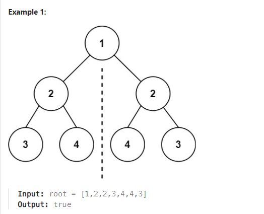
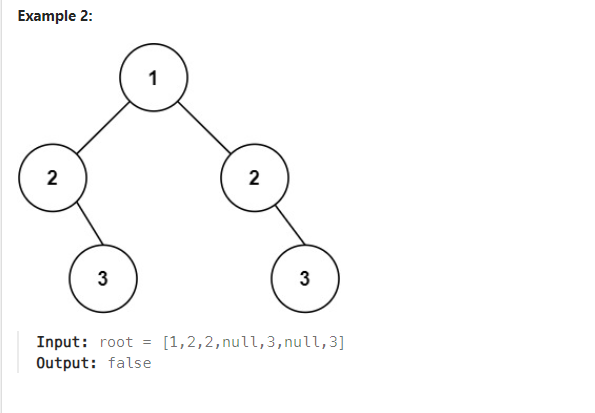

# Problem
[Symmetric Tree](https://leetcode.com/problems/symmetric-tree/description/)

Given the root of a binary tree, check whether it is a mirror of itself (i.e., symmetric around its center).







Constraints:

The number of nodes in the tree is in the range [1, 1000].
-100 <= Node.val <= 100

 
## Approach 1

### Pseudo code

```
Ý tưởng : duyệt cây theo ý tưởng là nếu cây chỉ có 1 node duy nhất là đúng, nếu có 2 cây con thì sai, còn nếu 2 cây con thì 2 cây con phải có cùng level và cây con bên cây con trái phải ngược với cây con của cây con bên phải => dùng đệ quy để duyệt

symmetric(left, right)
    // đều là node lá
    if left == right == NULL return true
    // khác level
    if left == NULL || right == NULL return false
    // khác giá trị
    if left->val != right->val return false
    return symmetric(left->left, right->right) && symmetric(left->right, right->left)
isSymmetric(root)
    // cây có 1 node
    if root == NULL return true
    return symmetric(root->left, root->right) 

```
### Code

```cpp
/**
 * Definition for a binary tree node.
 * struct TreeNode {
 *     int val;
 *     TreeNode *left;
 *     TreeNode *right;
 *     TreeNode() : val(0), left(nullptr), right(nullptr) {}
 *     TreeNode(int x) : val(x), left(nullptr), right(nullptr) {}
 *     TreeNode(int x, TreeNode *left, TreeNode *right) : val(x), left(left), right(right) {}
 * };
 */
class Solution {
public:
    bool symmetric(TreeNode* l, TreeNode* r){
        //B1 : 2 node đều là node lá , cùng độ cao -> true
        if(l == NULL && r == NULL) return true;
        //B2 : 1 trong 2 node khác độ cao
        if(l == NULL || r == NULL) return false;
        //B3 : 2 giá trị node khác nhau -> false
        if(l->val != r->val) return false;
        //B4 : check cây con bên trái vs bên phải và check cây con bên phải vs bên trái xem nó có phản chiếu lại nhau ko
        return symmetric(l->left, r->right) && symmetric(l->right, r->left);
    }
    bool isSymmetric(TreeNode* root) {
        //cây có 1 node
        if(root == NULL) return true;
        //Kt 2 cây con
        return symmetric(root->left, root->right);
    }
};

```

## Approach 2

### Pseudo
```
ý tưởng: dùng inorder traversal để đẩy từng phần tử theo hai hướng LNR ở nhánh phải và theo hưởng RNL
ở nhánh trái, nếu stack value của hai nhánh là tương ứng thì trả về true, ngược lại trả về false

function force(root)
    if root is NULL, return

    force(root->left)
    force(root->right)

    if root->left is NULL and root->right is not NULL:
        create a new TreeNode with value -1 and assign it to node
        assign node to root->left

    if root->right is NULL and root->left is not NULL:
        create a new TreeNode with value -1 and assign it to node
        assign node to root->right

function getLeftElement(root, valueStack)
    if root is NULL, return

    getLeftElement(root->left, valueStack)
    push root->val onto valueStack
    getLeftElement(root->right, valueStack)

function getRightElement(root, valueStack)
    if root is NULL, return

    getRightElement(root->right, valueStack)
    push root->val onto valueStack
    getRightElement(root->left, valueStack)

function isSymmetric(root)
    call force(root)
    create a stack called leftStack
    create a stack called rightStack

    call getLeftElement(root->left, leftStack)
    call getRightElement(root->right, rightStack)

    while leftStack is not empty and rightStack is not empty:
        if top element of leftStack is not equal to top element of rightStack:
            return false
        pop element from leftStack
        pop element from rightStack

    if leftStack is not empty or rightStack is not empty:
        return false
    return true

```
### Code
```cpp
/**
 * Definition for a binary tree node.
 * struct TreeNode {
 *     int val;
 *     TreeNode *left;
 *     TreeNode *right;
 *     TreeNode() : val(0), left(nullptr), right(nullptr) {}
 *     TreeNode(int x) : val(x), left(nullptr), right(nullptr) {}
 *     TreeNode(int x, TreeNode *left, TreeNode *right) : val(x), left(left),
 * right(right) {}
 * };
 */
class Solution {
public:
    void force(TreeNode* root) {
        if (root == NULL) return;

        force(root->left);
        force(root->right);

        if (root->left == NULL && root->right != NULL){
            TreeNode* node = new TreeNode (-1);
            root -> left = node;
        }

        if (root->right == NULL && root->left != NULL){
            TreeNode* node = new TreeNode (-1);
            root -> right = node;
        }
    }
    void getLeftElement(TreeNode* root, stack<int>& valueStack) {
        if (root == NULL) {
            return;
        }

        getLeftElement(root->left, valueStack);
        valueStack.push(root->val);
        getLeftElement(root->right, valueStack);
    }
    void getRightElement(TreeNode* root, stack<int>& valueStack) {
        if (root == NULL) {
            return;
        }

        getRightElement(root->right, valueStack);
        valueStack.push(root->val);
        getRightElement(root->left, valueStack);
    }
    bool isSymmetric(TreeNode* root) {
        force(root);
        stack<int> leftStack;
        stack<int> rightStack;

        getLeftElement(root->left, leftStack);
        getRightElement(root->right, rightStack);

        while (!leftStack.empty() && !rightStack.empty()) {
            if (leftStack.top() != rightStack.top())
                return false;
            leftStack.pop();
            rightStack.pop();
        }

        if (!leftStack.empty() || !rightStack.empty())
            return false;
        return true;
    }
};
```
