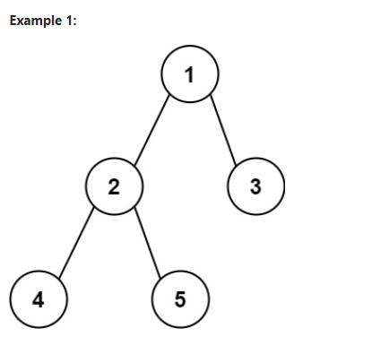

# Problem
[Diameter of Binary Tree](https://leetcode.com/problems/diameter-of-binary-tree/description/)

Given the root of a binary tree, return the length of the diameter of the tree.

The diameter of a binary tree is the length of the longest path between any two nodes in a tree. This path may or may not pass through the root.

The length of a path between two nodes is represented by the number of edges between them.

** example 1 **




```
Input: root = [1,2,3,4,5]
Output: 3
Explanation: 3 is the length of the path [4,2,1,3] or [5,2,1,3].
```

** example 2 **

```
Input: root = [1,2]
Output: 1
```

** constraint **
```
The number of nodes in the tree is in the range [1, 104].
-100 <= Node.val <= 100
```


## Approach 1

### Pseudo code

```
Ý tưởng : dùng đệ quy và sẽ tìm từ phần tử lá lên node đang xét, và ngầm hiểu node NULL = -1 và có xuất hiện node = 0 => mỗi lần gọi xong đệ quy ta sẽ được số cạnh bằng

find(root, d)
    if root == NULL return 0 //(node->left == NULL && node->right == NULL) return -1;
    l = find(root-left, d)
    r = find(root-right, d)
    //update d
    d = max(d, r + l) //tính được số cạnh của mỗi node đang xét
    // return 1 + max(l, r) // mỗi lần duyệt xong tức là nó có cạnh mà max d luôn return về 0 => add 1 để tính được số cạnh
diameterOfBinaryTree(root)
    d = 0;
    find(root, d)
    return d

```
### Code

```cpp
/**
 * Definition for a binary tree node.
 * struct TreeNode {
 *     int val;
 *     TreeNode *left;
 *     TreeNode *right;
 *     TreeNode() : val(0), left(nullptr), right(nullptr) {}
 *     TreeNode(int x) : val(x), left(nullptr), right(nullptr) {}
 *     TreeNode(int x, TreeNode *left, TreeNode *right) : val(x), left(left), right(right) {}
 * };
 */
class Solution{
public:
    int find(TreeNode* root, int &d){
        if(root == NULL) return 0;
        int l = find(root->left, d);
        int r = find(root->right, d);
        d = max(d, l + r);
        return 1 + max(l, r);
    }
    int diameterOfBinaryTree(TreeNode* root) {
        int d = 0;
        find(root, d);
        return d;
    }
};

```

## Approach 2

### Pseudo
```
ý tưởng: duyệt cây và so sánh theo quy tắc, đường kính của cây là số lớn nhất trong 3 số sau
- tổng chiều cao cây con bên trái + chiều cao cây con bên phải + 1
- đường kính của cây con trái
- đường kính của cây con phải


// Function to calculate the height of a binary tree
function height(root):
    // If the tree is empty, height is 0
    if root is NULL:
        return 0

    // Recursively calculate the height of left and right subtrees
    leftHeight = height(root.left)
    rightHeight = height(root.right)

    // Height of the tree is 1 + maximum of leftHeight and rightHeight
    return 1 + max(leftHeight, rightHeight)

// Function to calculate the diameter of a binary tree
function diameter(root):
    // If the tree is empty, diameter is 0
    if root is NULL:
        return 0

    // Calculate the height of left and right subtrees
    leftHeight = height(root.left)
    rightHeight = height(root.right)

    // Diameter passing through the root
    rootDiameter = leftHeight + rightHeight + 1

    // Calculate the diameter of left and right subtrees
    leftDiameter = diameter(root.left)
    rightDiameter = diameter(root.right)

    // Get the maximum diameter out of rootDiameter, leftDiameter, and rightDiameter
    maxDiameter = max(rootDiameter, leftDiameter, rightDiameter)

    return maxDiameter

// Wrapper function to calculate the diameter of the binary tree
function diameterOfBinaryTree(root):
    // Diameter function returns the number of nodes in the longest path
    // Subtract 1 to get the number of edges in the longest path
    return diameter(root) - 1

```
### Code
```cpp
/**
 * Definition for a binary tree node.
 * struct TreeNode {
 *     int val;
 *     TreeNode *left;
 *     TreeNode *right;
 *     TreeNode() : val(0), left(nullptr), right(nullptr) {}
 *     TreeNode(int x) : val(x), left(nullptr), right(nullptr) {}
 *     TreeNode(int x, TreeNode *left, TreeNode *right) : val(x), left(left), right(right) {}
 * };
 */
class Solution {
public:
    int height (TreeNode* root) {
        if (root == NULL) return 0;
        return 1 + std::max (height (root->left), height (root -> right));
    }

    int diameter (TreeNode* root) {
        if (root == NULL) return 0;
        // the height of left tree and right tree -> get the greater one
        int leftHeight = height (root -> left);
        int rightHeight = height (root -> right);

        int get = leftHeight + rightHeight + 1;
        
        int leftDia = diameter (root -> left);
        int rightDia = diameter (root -> right);

        int Get = (leftDia >= rightDia)? leftDia : rightDia;
        return (get >= Get) ? get : Get;
    }
    int diameterOfBinaryTree(TreeNode* root) {
        return diameter (root) -1;
    }
};
```

## Approach 3 [đang tham khảo thêm cách làm]

### Pseudo
```
ý tưởng, duyệt cây theo quy tắc tương tự cách 2, tuy nhiên cách này dùng morris traversal (duyệt cây ko có 
bất cứ cấu trúc dữ liệu hay kĩ thuật nào khác)

// ko có pseudo do chưa tự viết được
```

### Code [reference by GeeksforGeeks]
```cpp
// C++ code to implement the above approach that uses the
// morris traversal algorithm
#include <algorithm>
#include <iostream>

using namespace std;

// A tree node
struct Node {
    int data;
    struct Node* left;
    struct Node* right;
};

// Create a new node
Node* newNode(int data)
{
    Node* node = new Node;
    node->data = data;
    node->left = node->right = NULL;
    return (node);
}

// Morris traversal to find the diameter of the binary tree
int findDiameter(Node* root)
{
    if(root == NULL)
        return 0;
    if(root->left==NULL && root->right==NULL)
        return 1;
    int ans = 0;
    Node* curr = root;

    while (curr != NULL) {
        if (curr->left == NULL) {
            curr = curr->right;
        }
        else {
            Node* pre = curr->left;
            while (pre->right != NULL && pre->right != curr)
                pre = pre->right;
            if (pre->right == NULL) {
                pre->right = curr;
                curr = curr->left;
            }
            else {
                pre->right = NULL;
                int leftHeight = 0, rightHeight = 0;
                Node* temp = curr->left;
                while (temp != NULL) {
                    leftHeight++;
                    temp = temp->right;
                }
                temp = curr->right;
                while (temp != NULL) {
                    rightHeight++;
                    temp = temp->left;
                }
                ans = max(ans,
                          leftHeight + rightHeight + 1);
                curr = curr->right;
            }
        }
    }
    return ans;
}

// Driver code
int main()
{
    // Create the given binary tree
    Node* root = newNode(1);
    root->left = newNode(2);
    root->right = newNode(3);
    root->left->left = newNode(4);
    root->left->right = newNode(5);

    // Find the diameter of the binary tree using Morris
    // traversal
    int diameter = findDiameter(root);

    // Print the diameter of the binary tree
    cout << "The diameter of given binary tree is "
         << diameter << endl;

    return 0;
}
// This code is contributed by Veerendra_Singh_Rajpoot
// This code is modified by Susobhan Akhuli

```