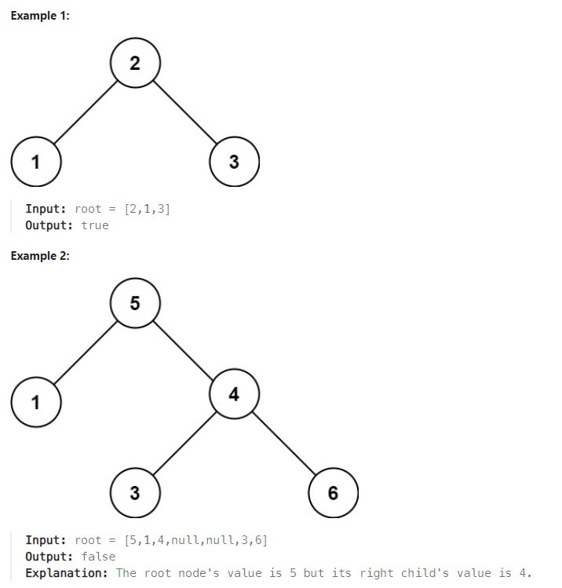

# Problem
[Validate Binary Search Tree](https://leetcode.com/problems/validate-binary-search-tree/)


Given the root of a binary tree, determine if it is a valid binary search tree (BST).

A valid BST is defined as follows:

The left 
subtree
 of a node contains only nodes with keys less than the node's key.
The right subtree of a node contains only nodes with keys greater than the node's key.
Both the left and right subtrees must also be binary search trees.





Constraints:
```
The number of nodes in the tree is in the range [1, 104].
-231 <= Node.val <= 231 - 1
```


## Approach 
### Pseudo
```
Function isBST(node, min, max):
    If node is null:
        Return true
    If node's value is less than or equal to min OR node's value is greater than or equal to max:
        Return false
    Return isBST(node's left child, min, node's value) AND isBST(node's right child, node's value, max)

Function isValidBST(root):
    Return isBST(root, -infinity, +infinity)

```
### Code
```
/**
 * Definition for a binary tree node.
 * struct TreeNode {
 *     int val;
 *     TreeNode *left;
 *     TreeNode *right;
 *     TreeNode() : val(0), left(nullptr), right(nullptr) {}
 *     TreeNode(int x) : val(x), left(nullptr), right(nullptr) {}
 *     TreeNode(int x, TreeNode *left, TreeNode *right) : val(x), left(left),
 * right(right) {}
 * };
 */
class Solution {
public:
    bool isBST(TreeNode* node, long long min, long long max) {
        if (node == nullptr) {
            return true;
        }
        if (node->val <= min || node->val >= max) {
            return false;
        }
        return isBST(node->left, min, node->val) &&
               isBST(node->right, node->val, max);
    }

    bool isValidBST(TreeNode* root) {
        return isBST (root, -1e12, +1e12);
    }
};
```