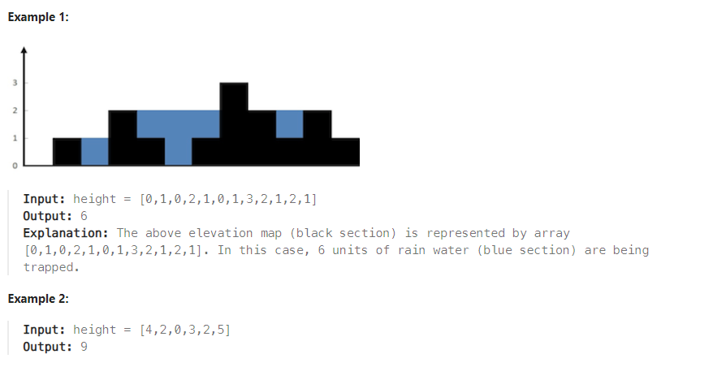

# Problem
[Trapping Rain Water](https://leetcode.com/problems/trapping-rain-water/)


Given n non-negative integers representing an elevation map where the width of each bar is 1, compute how much water it can trap after raining.




Constraints:
```
n == height.length
1 <= n <= 2 * 104
0 <= height[i] <= 105
```

## Approach 1 [pass 320/322]
### Pseudocode
```
Function filter(height, currentTop):
    zeroPosition <- -1
    
    # Remove leading elements equal to currentTop - 2
    While height[zeroPosition + 1] == currentTop - 2:
        zeroPosition <- zeroPosition + 1
    End While
    Remove elements from height starting from the beginning to zeroPosition + 1
    
    zeroPosition <- size of height - 1
    
    # Remove trailing elements equal to currentTop - 2
    While height[zeroPosition] == currentTop - 2:
        zeroPosition <- zeroPosition - 1
    End While
    Remove elements from height starting from zeroPosition + 1 to the end

Function trap(height):
    bucket <- 0
    maxWall <- maximum value in height
    
    # Iterate over possible water levels
    For currentHeight from 2 to maxWall + 1:
        Call filter(height, currentHeight)
        
        # Increment bucket for bars that are below the current water level
        For each bar in height:
            If bar + 1 < currentHeight:
                bucket <- bucket + 1
                bar <- bar + 1
            End If
        End For
    End For
    
    Return bucket

```

### Code
```cpp
class Solution {
public:
    void filter (vector <int>& height, int currentTop) {
        int zeroPosition = -1;
        while (height[zeroPosition + 1] == currentTop - 2) ++zeroPosition;
        height.erase (height.begin(), height.begin () + zeroPosition + 1);

		zeroPosition = height.size () - 1;
		while (height[zeroPosition] == currentTop - 2) --zeroPosition;
		height.erase (height.begin () + zeroPosition + 1, height.end());
        
    }
    int trap(vector<int>& height) {
		int bucket = 0;
        int maxWall = *max_element (height.begin(), height.end());
		for (int currentHeight = 2; currentHeight <= maxWall + 1; ++currentHeight){
			filter (height, currentHeight);
			for (int& bar : height){
				if (bar + 1 < currentHeight) {
					++bucket;
					++bar;
				}
			}
		}
        return bucket;
    }
};

```

## Approach 2 [enhance the Approach 1]
### Pseudocode
```
Function trap(height):
    Initialize bucket to 0
    
    # Loop through each element in height except the first and last
    For i from 1 to size of height - 1:
        Set first to height[i]
        Set last to height[i]
        
        # Find the maximum height to the left of the current element
        For j from 0 to i - 1:
            first = max(height[j], first)
        End For
        
        # Find the maximum height to the right of the current element
        For j from i + 1 to size of height - 1:
            last = max(height[j], last)
        End For
        
        # Calculate water trapped at the current element
        bucket = bucket + min(first, last) - height[i]
    End For
    
    Return bucket


```
### Code
```cpp
class Solution {
public:
    int trap(vector<int>& height) {
        int bucket = 0;
        for (int i = 1; i < height.size() - 1; ++i){
            int first = height[i];
            int last = height[i];
            for (int j = 0; j < i; ++j){
                first = std::max (height[j], first);
            }
            for (int j = i + 1; j < height.size(); ++j){
                last = std::max (height[j], last);
            }

            bucket += std::min (first, last) - height[i];
        }
        return bucket;
    }
};
```

## Approach 3 [enhance the Approach 2]
### Pseudocode
```
Function trap(height):
    Initialize bucket to 0
    
    # Initialize maxLeft and maxRight vectors with size of height and fill with 0
    maxLeft <- array of size height filled with 0
    maxRight <- array of size height filled with 0

    # Set the first element of maxLeft and the last element of maxRight
    maxLeft[0] <- height[0]
    maxRight[size of height - 1] <- height[size of height - 1]

    # Populate maxLeft with maximum heights from the left up to each position
    For i from 1 to size of height - 1:
        maxLeft[i] <- max(maxLeft[i - 1], height[i])
    End For

    # Populate maxRight with maximum heights from the right up to each position
    For i from size of height - 2 to 0 step -1:
        maxRight[i] <- max(maxRight[i + 1], height[i])
    End For

    # Calculate trapped water
    For i from 1 to size of height - 2:
        bar <- min(maxLeft[i - 1], maxRight[i + 1])
        If bar > height[i]:
            bucket <- bucket + bar - height[i]
        End If
    End For

    Return bucket

```
### Code
```cpp
class Solution {
public:
    int trap(vector<int>& height) {
        int bucket = 0;
        vector <int> maxLeft (height.size(), 0);
        vector <int> maxRight (height.size(), 0);

        maxLeft[0] = height[0];
        maxRight[height.size ()-1] = height[height.size () -1];

        for (int i = 1; i < maxLeft.size (); ++i) maxLeft[i] = max (maxLeft[i-1], height[i]);
        for (int i = maxRight.size ()- 2; i >= 0; --i) maxRight[i] = max (maxRight[i+1], height[i]);

        for (int i = 1; i < height.size() - 1; ++i){
            int bar = min (maxLeft[i-1], maxRight[i+1]);
            if (bar > height[i]) bucket += bar - height[i];
        }
        return bucket;
    }
};
```