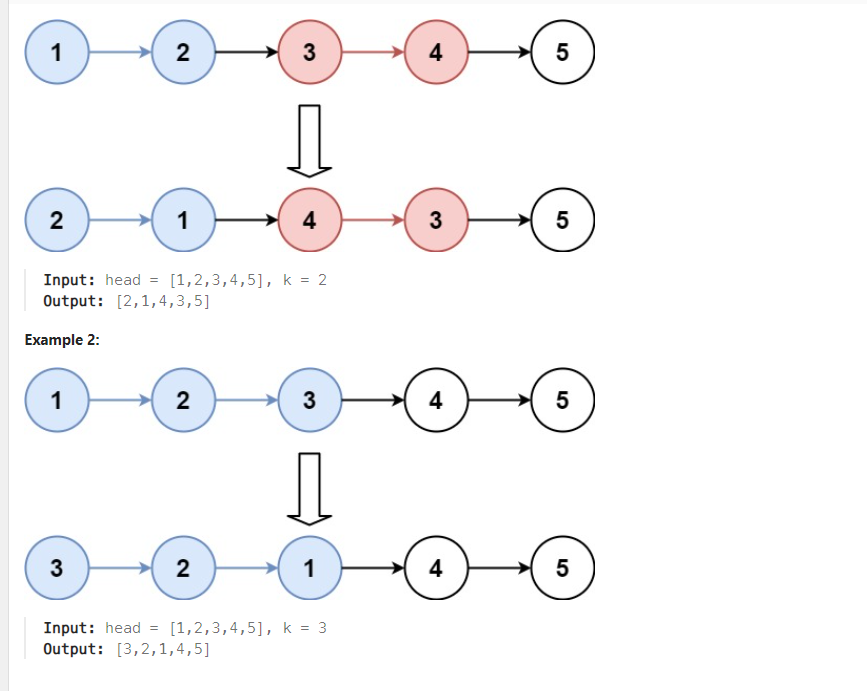

# Problem

 [Reverse Nodes in k-Group](https://leetcode.com/problems/reverse-nodes-in-k-group/description/)

Given the head of a linked list, reverse the nodes of the list k at a time, and return the modified list.

k is a positive integer and is less than or equal to the length of the linked list. If the number of nodes is not a multiple of k then left-out nodes, in the end, should remain as it is.





You may not alter the values in the list's nodes, only nodes themselves may be changed.

**constraint**
```
-The number of nodes in the list is n.
-1 <= k <= n <= 5000
-0 <= Node.val <= 1000
```

## Approach
### Pseudo
```
ý tưởng: lật ngược từng phần bằng hàng reverse rồi đem nối chúng lại với nhau thông qua con trỏ next ở cuối
môi phần

function reverse(head, k):
    prev = null
    curr = head
    while k > 0:
        next = curr.next
        curr.next = prev
        prev = curr
        curr = next
        k = k - 1
    return prev

function reverseKGroup(head, k):
    length = 0
    node = head
    while node:
        length = length + 1
        node = node.next

    dummy = new ListNode(0)
    dummy.next = head
    prevGroupEnd = dummy

    while length >= k:
        groupStart = prevGroupEnd.next
        groupEnd = groupStart
        for i = 0 to k - 2:
            groupEnd = groupEnd.next

        nextGroupStart = groupEnd.next
        newGroupStart = reverse(groupStart, k)
        prevGroupEnd.next = newGroupStart
        groupStart.next = nextGroupStart
        prevGroupEnd = groupStart
        length = length - k

    return dummy.next
```

### Code
```cpp
class Solution {
public:
    ListNode* reverse(ListNode* head, int k) {
        ListNode* prev = nullptr;
        ListNode* curr = head;
        while (k > 0) {
            ListNode* next = curr->next;
            curr->next = prev;
            prev = curr;
            curr = next;
            k--;
        }
        return prev;
    }
    ListNode* reverseKGroup(ListNode* head, int k) {
        int length = 0;
        ListNode* node = head;
        while (node) {
            length++;
            node = node->next;
        }

        ListNode dummy(0);
        dummy.next = head;
        ListNode* prevGroupEnd = &dummy;

        while (length >= k) {
            ListNode* groupStart = prevGroupEnd->next;
            ListNode* groupEnd = groupStart;

            for (int i = 0; i < k - 1; i++) {
                groupEnd = groupEnd->next;
            }

            ListNode* nextGroupStart = groupEnd->next;
            ListNode* newGroupStart = reverse(groupStart, k);
            prevGroupEnd->next = newGroupStart;
            groupStart->next = nextGroupStart;
            prevGroupEnd = groupStart;
            length -= k;
        }

        return dummy.next;
    }
};
```