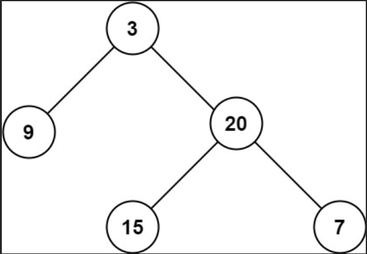

# Problem

[Maximum Depth of Binary Tree](https://leetcode.com/problems/maximum-depth-of-binary-tree/description/)

Given the root of a binary tree, return its maximum depth.

A binary tree's maximum depth is the number of nodes along the longest path from the root node down to the farthest leaf node. 

Example 1:



Input: root = [3,9,20,null,null,15,7]
Output: 3

Example 2:

Input: root = [1,null,2]
Output: 2
 

Constraints:

The number of nodes in the tree is in the range [0, 104].
-100 <= Node.val <= 100

 
## Approach 

### Pseudo code

```
Ý tưởng : duyệt độ sâu của cây, ứng dụng của DFS
từ node root -> sẽ đi tìm đến mỗi nhánh và đếm số node trên đường đi đó => nhiều node nhất => sâu nhất

maxDepth(root)
    if root == NULL return 0 //0 đại diện cho node ko có con
    l = maxDepth(root->left) // tìm đến node sâu nhất ở cây con bên trái
    r = maxDepth(root-> right) // tìm node sâu nhất cây con bên phải
    return max(l, r) + 1 // ứng với mỗi node tìm đc + 1 để tính độ sâu của cây

P/s : đây là cách tối ưu nhất của bài này, và dễ code nhất

```
### Code

```cpp
/**
 * Definition for a binary tree node.
 * struct TreeNode {
 *     int val;
 *     TreeNode *left;
 *     TreeNode *right;
 *     TreeNode() : val(0), left(nullptr), right(nullptr) {}
 *     TreeNode(int x) : val(x), left(nullptr), right(nullptr) {}
 *     TreeNode(int x, TreeNode *left, TreeNode *right) : val(x), left(left), right(right) {}
 * };
 */
class Solution {
public:
    int maxDepth(TreeNode* root) {
        if(root == NULL) return 0;
        else return max(maxDepth(root->left) + 1, maxDepth(root->right) + 1);
    }
};

```

