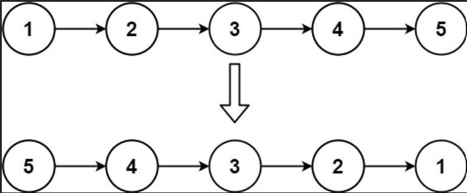
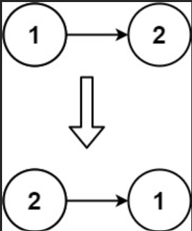
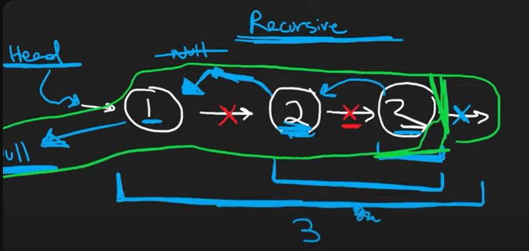

# Problem

[Reverse Linked List](https://leetcode.com/problems/reverse-linked-list/description/)

Given the head of a singly linked list, reverse the list, and return the reversed list.

Example 1:



Input: head = [1,2,3,4,5]
Output: [5,4,3,2,1]

Example 2:



Input: head = [1,2]
Output: [2,1]

Example 3:

Input: head = []
Output: []
 

Constraints:

The number of nodes in the list is the range [0, 5000].
-5000 <= Node.val <= 5000
 

Follow up: A linked list can be reversed either iteratively or recursively. Could you implement both?

 
## Approach 1

### Pseudo code

```
Ý tưởng : dùng kĩ thuật 2 con trỏ node head và node prev để dịch chuyển ngược lại chiều mà head->next trỏ tới : VD 1->2->3->NULL => NULL<-1<-2<-3

Node* prev = NULL
while head != NULL
    Node* tmp = head -> next //lưu lại mạch nối của linked list ban đầu để khi đổi chiều trỏ thì ko bị mất
    head->next = prev
    prev = head
    head = tmp
return prev

```
### Code

```cpp
/**
 * Definition for singly-linked list.
 * struct ListNode {
 *     int val;
 *     ListNode *next;
 *     ListNode() : val(0), next(nullptr) {}
 *     ListNode(int x) : val(x), next(nullptr) {}
 *     ListNode(int x, ListNode *next) : val(x), next(next) {}
 * };
 */
class Solution {
public:
    ListNode* reverseList(ListNode* head) {
        ListNode* prev = NULL;
        while(head != NULL){
            ListNode* tmp = head->next;
            head->next = prev;
            prev = head;
            head = tmp;
        }
        return prev;
    }
};

```

 
## Approach 2

### Pseudo code

```
Ý tưởng : dùng đệ quy đảo ngược chiều trỏ của mỗi node

```


### Code

```cpp
/**
 * Definition for singly-linked list.
 * struct ListNode {
 *     int val;
 *     ListNode *next;
 *     ListNode() : val(0), next(nullptr) {}
 *     ListNode(int x) : val(x), next(nullptr) {}
 *     ListNode(int x, ListNode *next) : val(x), next(next) {}
 * };
 */
class Solution {
public:
    ListNode* reverseList(ListNode* head) {
        if(head == NULL || head->next == NULL) return head;
        ListNode* newHead = reverseList(head->next);
        head->next->next = head;
        head->next = NULL;
        return newHead;
    }
};

```


