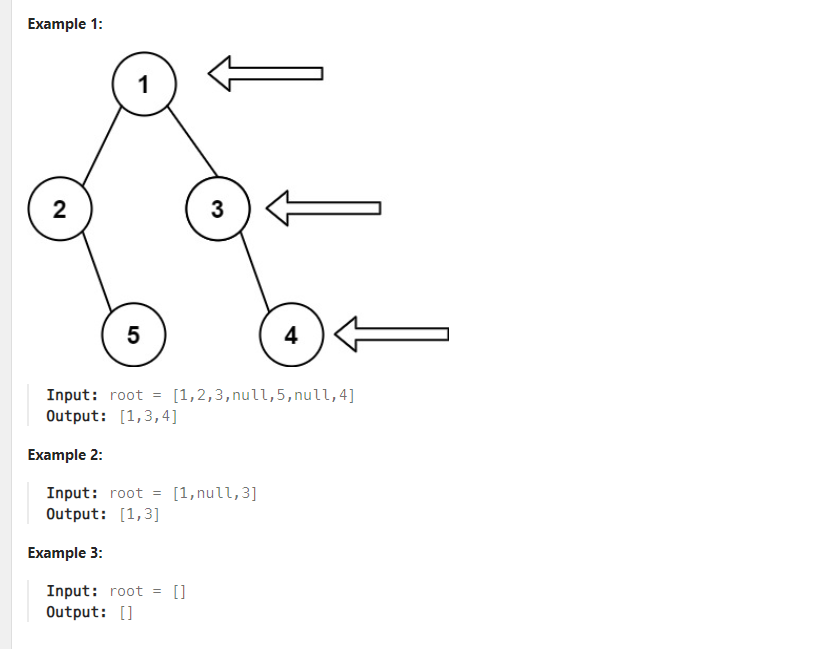
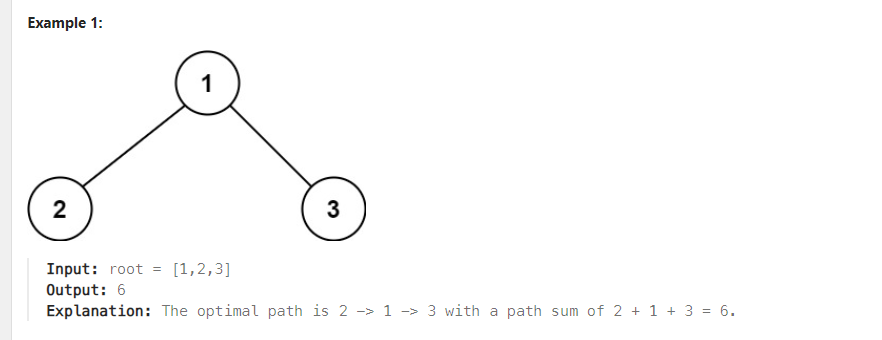
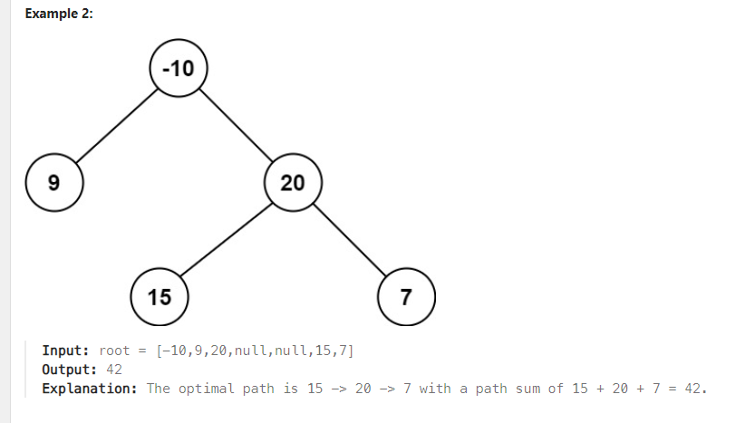

# Problem 1
[Binary Tree Right Side View](https://leetcode.com/problems/binary-tree-right-side-view/description/)

Given the root of a binary tree, imagine yourself standing on the right side of it, return the
values of the nodes you can see ordered from top to bottom.



*Constraints:*

-The number of nodes in the tree is in the range [0, 100].
--100 <= Node.val <= 100

## Approach
### Pseudo
```
dùng hai hàng đợi (hoặc hai stack, DS nào cũng được miễn lưu được dữ liệu), duyệt cây
bằng BFS (level order), cứ mối hàng ta sẽ lấy phần tử cuối cùng của hàng đó đẩy vào
danh sách kết quả

function rightSideView(root):
    create an empty list nodeList to store the result
    if root is null:
        return an empty list

    create two queues: bucket1 and bucket2
    push root into bucket1

    while bucket1 is not empty or bucket2 is not empty:
        if bucket1 is empty:
            break

        // Add the value of the rightmost node of bucket1 to nodeList
        add bucket1.back().val to nodeList

        // Process all nodes in bucket1
        while bucket1 is not empty:
            node = bucket1.front()
            bucket1.pop()

            // Add the left and right children of node to bucket2 if they exist
            if node.left exists:
                bucket2.push(node.left)
            if node.right exists:
                bucket2.push(node.right)

        if bucket2 is empty:
            break

        // Add the value of the rightmost node of bucket2 to nodeList
        add bucket2.back().val to nodeList

        // Process all nodes in bucket2
        while bucket2 is not empty:
            node = bucket2.front()
            bucket2.pop()

            // Add the left and right children of node to bucket1 if they exist
            if node.left exists:
                bucket1.push(node.left)
            if node.right exists:
                bucket1.push(node.right)

    return nodeList

```

### Code
```cpp
/**
 * Definition for a binary tree node.
 * struct TreeNode {
 *     int val;
 *     TreeNode *left;
 *     TreeNode *right;
 *     TreeNode() : val(0), left(nullptr), right(nullptr) {}
 *     TreeNode(int x) : val(x), left(nullptr), right(nullptr) {}
 *     TreeNode(int x, TreeNode *left, TreeNode *right) : val(x), left(left), right(right) {}
 * };
 */
class Solution {
public:
    vector<int> rightSideView(TreeNode* root) {
        vector <int> nodeList;
        if (root == NULL) return {};
        std::queue <TreeNode*> bucket1;
        std::queue <TreeNode*> bucket2;
        bucket1.push (root);
        while (!bucket1.empty() || !bucket2.empty()) {
            if (bucket1.empty()) break;
            nodeList.push_back (bucket1.back() -> val);
            while (!bucket1.empty ()) {
                TreeNode* node = bucket1.front ();
                bucket1.pop ();
                if (node -> left) bucket2.push (node -> left);
                if (node -> right) bucket2.push (node -> right);
            }
            if (bucket2.empty()) break;
            nodeList.push_back (bucket2.back() -> val);
            while (!bucket2.empty ()) {
                TreeNode* node = bucket2.front ();
                bucket2.pop ();
                if (node -> left) bucket1.push (node -> left);
                if (node -> right) bucket1.push (node -> right);
            }
        }
        return nodeList;
    }
};
```

# Problem 2
[Binary Tree Maximum Path Sum](https://leetcode.com/problems/binary-tree-maximum-path-sum/description/)

A path in a binary tree is a sequence of nodes where each pair of adjacent nodes in the sequence has an edge connecting them. 
A node can only appear in the sequence at most once. Note that the path does not need to pass through the root.

The path sum of a path is the sum of the node's values in the path.

Given the root of a binary tree, return the maximum path sum of any non-empty path.





*Constraints:*

-The number of nodes in the tree is in the range [1, 3 * 104].
--1000 <= Node.val <= 1000

## Approach
### Pseudo
```
tính toán theo công thức chung
max path =the max value among: max path of left subtree, max path of right subtree, max path left + max path right + value of root

sử dụng DFS để tính toán theo công thức trên + đệ quy


function dfs(root, maxPath):
    if root is null:
        return 0

    // Recursively compute the maximum path sum of the left subtree and right subtree
    leftPath = max(dfs(root.left, maxPath), 0)
    rightPath = max(dfs(root.right, maxPath), 0)

    // Calculate the maximum path sum passing through the current node
    currentPathSum = leftPath + rightPath + root.val

    // Update the global maximum path sum if the current path sum is greater
    maxPath = max(maxPath, currentPathSum)

    // Return the maximum path sum of the current node including one of its subtrees
    return max(leftPath, rightPath) + root.val

function maxPathSum(root):
    initialize maxSum to a very small value (negative infinity)
    
    // Start the DFS traversal to calculate the maximum path sum
    dfs(root, maxSum)
    
    return maxSum
```

### Code
```cpp
/**
 * Definition for a binary tree node.
 * struct TreeNode {
 *     int val;
 *     TreeNode *left;
 *     TreeNode *right;
 *     TreeNode() : val(0), left(nullptr), right(nullptr) {}
 *     TreeNode(int x) : val(x), left(nullptr), right(nullptr) {}
 *     TreeNode(int x, TreeNode *left, TreeNode *right) : val(x), left(left), right(right) {}
 * };
 */
class Solution {
public:
    int dfs (TreeNode* root, int& maxPath) {
        if (root == NULL) return 0;
        int leftPath = std::max (dfs (root -> left, maxPath), 0);
        int rightPath = std::max (dfs (root -> right, maxPath), 0);
        maxPath = std::max (maxPath, leftPath + rightPath + root -> val);
        return std::max (leftPath, rightPath) + root -> val;
    }
    int maxPathSum(TreeNode* root) {
        int maxSum = INT32_MIN;
        dfs (root, maxSum);
        return maxSum;
    }
};
```