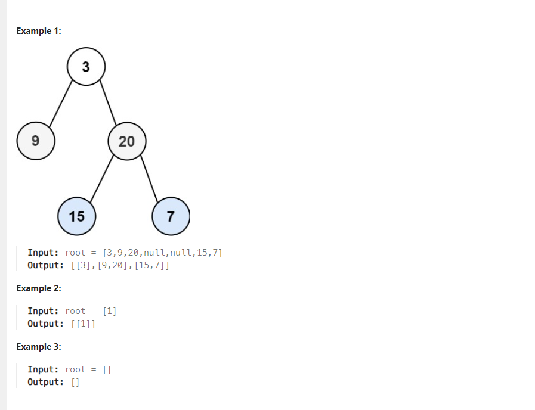

# Problem 1
[Binary Tree Level Order Traversal](https://leetcode.com/problems/binary-tree-level-order-traversal/description/)

Given the root of a binary tree, return the level order traversal of its nodes' values. (i.e., from left to right, level by level).

 

*Constraints:*
```
The number of nodes in the tree is in the range [0, 2000].
-1000 <= Node.val <= 1000
```

## Approach
### Pseudo
```
function levelOrder(root)
    if root is NULL
        return an empty list

    initialize v as an empty list of lists
    initialize q as an empty queue
    enqueue root into q

    while q is not empty
        t = size of q
        initialize a as an empty list

        for i from 0 to t - 1
            node = front element of q
            dequeue q
            append value of node to a

            if node has a left child
                enqueue left child of node into q

            if node has a right child
                enqueue right child of node into q

        append a to v

    return v

```
### Code
```cpp
/**
 * Definition for a binary tree node.
 * struct TreeNode {
 *     int val;
 *     TreeNode *left;
 *     TreeNode *right;
 *     TreeNode() : val(0), left(nullptr), right(nullptr) {}
 *     TreeNode(int x) : val(x), left(nullptr), right(nullptr) {}
 *     TreeNode(int x, TreeNode *left, TreeNode *right) : val(x), left(left), right(right) {}
 * };
 */
class Solution {
public:
    vector<vector<int>> levelOrder(TreeNode* root) {
        if (root == NULL) return {};
        vector <vector <int>> v;
        std::queue <TreeNode*> q;
        q.push (root);
        while (!q.empty()) {
            int t = q.size ();
            vector <int> a;
            for (int i = 0; i < t; ++i) {
                TreeNode* node = q.front ();
                q.pop ();
                a.push_back (node -> val);
                if (node -> left) q.push (node -> left);
                if (node -> right) q.push (node -> right);
            }
            v.push_back (a);
        }
        return v;
    }
};
```

# Problem 2
[Number Of Islands](https://leetcode.com/problems/number-of-islands/description/)

Given an m x n 2D binary grid grid which represents a map of '1's (land) and '0's (water), return the number of islands.

An island is surrounded by water and is formed by connecting adjacent lands horizontally or vertically. You may assume 
all four edges of the grid are all surrounded by water.

*Example 1:*
```
Input: grid = [
  ["1","1","1","1","0"],
  ["1","1","0","1","0"],
  ["1","1","0","0","0"],
  ["0","0","0","0","0"]
]
Output: 1
```
*Example 2:*
```
Input: grid = [
  ["1","1","0","0","0"],
  ["1","1","0","0","0"],
  ["0","0","1","0","0"],
  ["0","0","0","1","1"]
]
Output: 3
 ```

*Constraints:*
```
m == grid.length
n == grid[i].length
1 <= m, n <= 300
grid[i][j] is '0' or '1'.
```

## Approach 1 (DFS)
### Pseudo
```
ý tưởng: dùng BFS trên mảng hai chiều, tương tự bài dầu loang, đếm xem có bao nhiêu thành phần tách biệt

function BFS(i, j, grid, visited)
    initialize dx as [1, 0, 0, -1]
    initialize dy as [0, 1, -1, 0]
    n = number of rows in grid
    m = number of columns in grid
    initialize queue q
    enqueue (i, j) into q
    mark visited[i][j] as 1
    set grid[i][j] to '0'
    
    while q is not empty
        x = front element of q
        dequeue q
        
        for direction in range 4
            i1 = x.first + dx[direction]
            j1 = x.second + dy[direction]
            
            if i1 is within grid boundaries and j1 is within grid boundaries and visited[i1][j1] is 0 and grid[i1][j1] is '1'
                set grid[i1][j1] to '0'
                enqueue (i1, j1) into q
                mark visited[i1][j1] as 1

function numIslands(grid)
    initialize visited as a 2D list with size of grid filled with 0
    cnt = 0
    
    for i from 0 to number of rows in grid - 1
        for j from 0 to number of columns in grid - 1
            if grid[i][j] is '1'
                increment cnt by 1
                call BFS(i, j, grid, visited)
    
    return cnt

```
### Code
```cpp
class Solution {
public:
    vector <int> dx = {1, 0, 0, -1};
    vector <int> dy = {0, 1, -1, 0};
    void BFS (int i, int j, vector <vector <char>>& grid, vector <vector <int>>& visited) {
        int n = grid.size ();
        int m = grid[0].size ();
        std::queue <std::pair <int, int>> q;
        q.push ({i, j});
        visited[i][j] = 1;
        grid[i][j] = '0';
        while (!q.empty ()) {
            std::pair <int, int> x = q.front ();
            q.pop ();
            for (int i = 0; i < 4; ++i) {
                int i1 = x.first + dx[i];
                int j1 = x.second + dy[i];
                if (i1 >= 0 && i1 < n && j1 >= 0 && j1 < m && visited[i1][j1] == 0 && grid[i1][j1] != '0') {
                    grid[i1][j1] = '0';
                    q.push ({i1, j1});
                    visited[i1][j1] = 1;
                }
            }
        }
    }
    int numIslands(vector<vector<char>>& grid) {
        vector <vector <int>>visited (grid.size());
        vector <int> a (grid[0].size(), 0);
        for (auto& i : visited) {
            i = a;
        }
        int cnt = 0;
        for (int i = 0; i < grid.size (); ++i) {
            for (int j = 0; j < grid[0].size(); ++j) {
                if (grid[i][j] == '1') {
                    ++cnt;
                    BFS (i, j, grid, visited);
                }
            }
        }
        return cnt;
    }
};
```

## Approach 2 (DFS)
### Pseudo
```
ý tưởng: tương tự như cách trên mà ta dùng DFS thay vì BFS

initialize dx as [1, 0, 0, -1]
initialize dy as [0, 1, -1, 0]

function DFS(i, j, grid, visited)
    n = number of rows in grid
    m = number of columns in grid
    mark visited[i][j] as 1
    set grid[i][j] to '0'

    for k from 0 to 3
        i1 = i + dx[k]
        j1 = j + dy[k]

        if i1 is within grid boundaries and j1 is within grid boundaries and visited[i1][j1] is 0 and grid[i1][j1] is '1'
            call DFS(i1, j1, grid, visited)

function numIslands(grid)
    n = number of rows in grid
    m = number of columns in grid
    initialize visited as a 2D list of size n x m filled with 0
    cnt = 0

    for i from 0 to n - 1
        for j from 0 to m - 1
            if grid[i][j] is '1'
                increment cnt by 1
                call DFS(i, j, grid, visited)

    return cnt

```

### Code
```cpp
class Solution {
public:
    vector <int> dx = {1, 0, 0, -1};
    vector <int> dy = {0, 1, -1, 0};
    void DFS (int i, int j, vector <vector <char>>& grid, vector <vector <int>>& visited) {
        int n = grid.size ();
        int m = grid[0].size ();
        visited[i][j] = 1;
        grid[i][j] = '0';
        for (int k = 0; k < 4; ++k) {
            int i1 = i + dx[k];
            int j1 = j + dy[k];
            if (i1 >= 0 && i1 < n && j1 >= 0 && j1 < m && visited[i1][j1] == 0 && grid[i1][j1] != '0') {
                DFS (i1, j1, grid, visited);
            }
        }
        
    }
    int numIslands(vector<vector<char>>& grid) {
        vector <vector <int>>visited (grid.size());
        vector <int> a (grid[0].size(), 0);
        for (auto& i : visited) {
            i = a;
        }
        int cnt = 0;
        for (int i = 0; i < grid.size (); ++i) {
            for (int j = 0; j < grid[0].size(); ++j) {
                if (grid[i][j] == '1') {
                    ++cnt;
                    DFS (i, j, grid, visited);
                }
            }
        }
        return cnt;
    }
};
```
