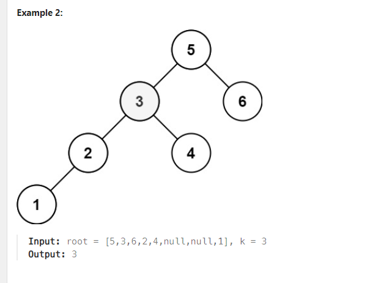

# Problem
[Kth Smallest Element in a BST](https://leetcode.com/problems/kth-smallest-element-in-a-bst/description/)

Given the root of a binary search tree, and an integer k, return the kth smallest value (1-indexed) of all
the values of the nodes in the tree.




*Constraints:*
```
The number of nodes in the tree is n.
1 <= k <= n <= 104
0 <= Node.val <= 104
```

## Approach 1
### Pseudo
```
dùng inorder traversal để duyệt cây, tức là đẩy từng phần tử vào một vector
phần tử thử k-1 chính là phần tử cần tim

function get(v, root)
    if root is NULL
        return
    end if
    
    // Traverse the left subtree
    get(v, root.left)
    
    // Visit the current node
    v.push_back(root.val)
    
    // Traverse the right subtree
    get(v, root.right)
end function

function kthSmallest(root, k)
    // Create an empty list to store the node values
    v = empty list
    
    // Perform in-order traversal and fill the list
    get(v, root)
    
    // Return the k-th smallest element (1-indexed, so use k-1 for 0-indexed list)
    return v[k - 1]
end function

```
### Code
```cpp
/**
 * Definition for a binary tree node.
 * struct TreeNode {
 *     int val;
 *     TreeNode *left;
 *     TreeNode *right;
 *     TreeNode() : val(0), left(nullptr), right(nullptr) {}
 *     TreeNode(int x) : val(x), left(nullptr), right(nullptr) {}
 *     TreeNode(int x, TreeNode *left, TreeNode *right) : val(x), left(left), right(right) {}
 * };
 */
class Solution {
public:
    void get (vector <int>& v, TreeNode* root) {
        if (root == NULL) return;
        get (v, root -> left);
        v.push_back (root -> val);
        get (v, root -> right);
    }
     int kthSmallest(TreeNode* root, int k) {
        vector <int> v;
        get (v, root);
        return v[k-1];
    }
};
```

## Approach 2
### Pseudo
```
dùng đệ quy tìm kiếm trong cây nhị phân, ứng dụng của inorder traversal

function get(root, cnt, r, k)
    if root is NULL
        return
    end if
    
    // Traverse the left subtree
    get(root.left, cnt, r, k)
    
    // Increment the counter for each visited node
    cnt = cnt + 1
    
    // Check if the current node is the k-th smallest
    if cnt == k
        r = root.val
        return
    end if
    
    // Traverse the right subtree
    get(root.right, cnt, r, k)
end function

function kthSmallest(root, k)
    // Initialize the result and counter variables
    r = 0
    cnt = 0
    
    // Perform in-order traversal and find the k-th smallest element
    get(root, cnt, r, k)
    
    // Return the k-th smallest element
    return r
end function
```

### Code
```cpp
/**
 * Definition for a binary tree node.
 * struct TreeNode {
 *     int val;
 *     TreeNode *left;
 *     TreeNode *right;
 *     TreeNode() : val(0), left(nullptr), right(nullptr) {}
 *     TreeNode(int x) : val(x), left(nullptr), right(nullptr) {}
 *     TreeNode(int x, TreeNode *left, TreeNode *right) : val(x), left(left), right(right) {}
 * };
 */
class Solution {
public:
    void get (TreeNode* root,int& cnt, int& r, int k) {
        if (root == NULL) return;
        get (root -> left,cnt, r,k);
        ++cnt;
        if (cnt == k) {
            r = root -> val;
            return;
        }
        get (root -> right,cnt,r, k);
    }
     int kthSmallest(TreeNode* root, int k) {
        int r = 0;
        int cnt = 0;
        get (root,cnt, r, k);
        return r;
    }
};
```